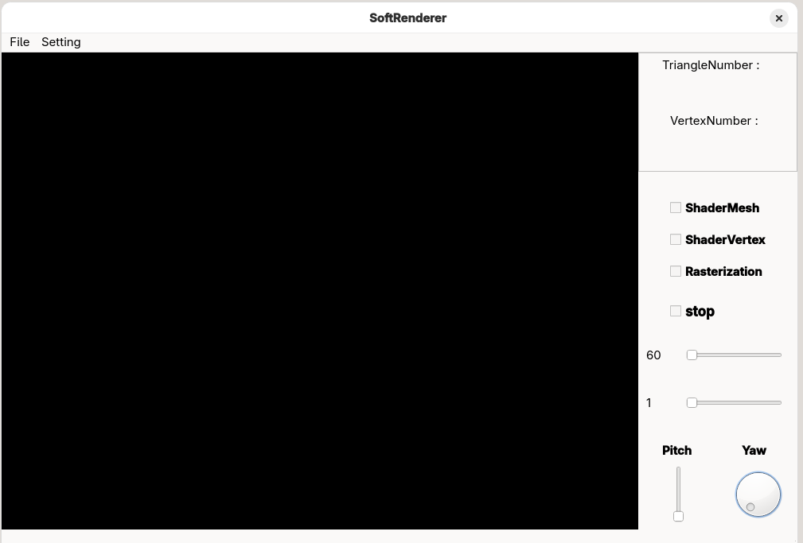
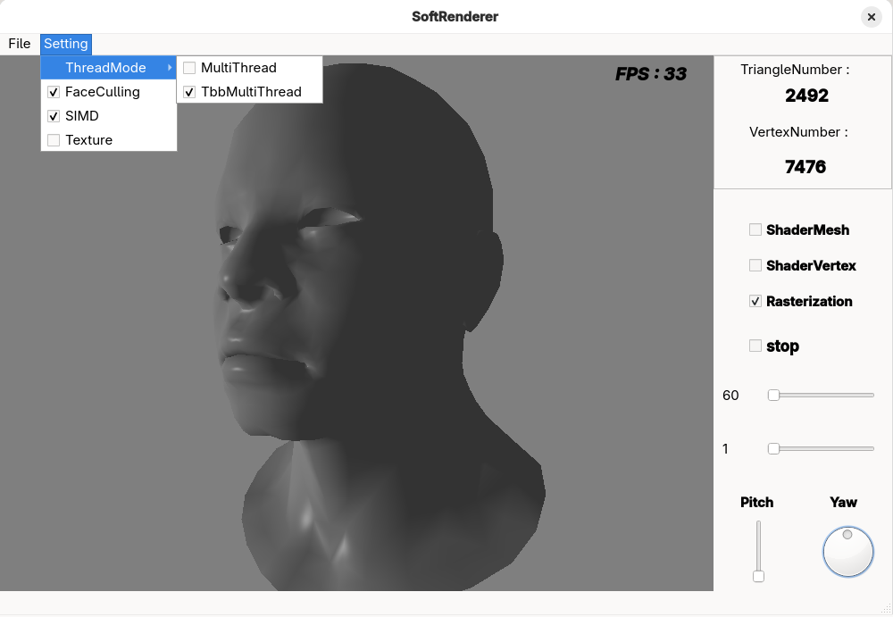
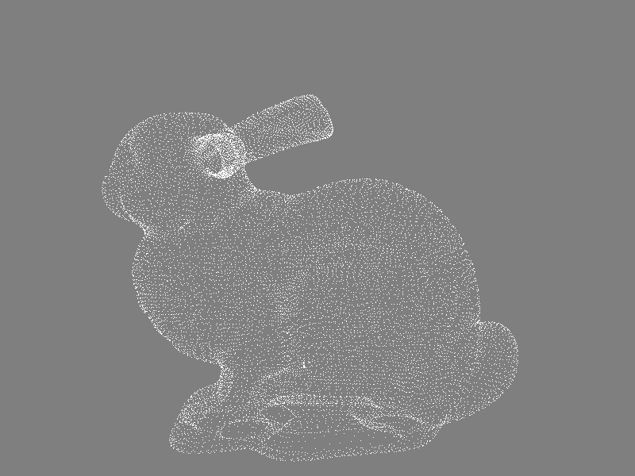
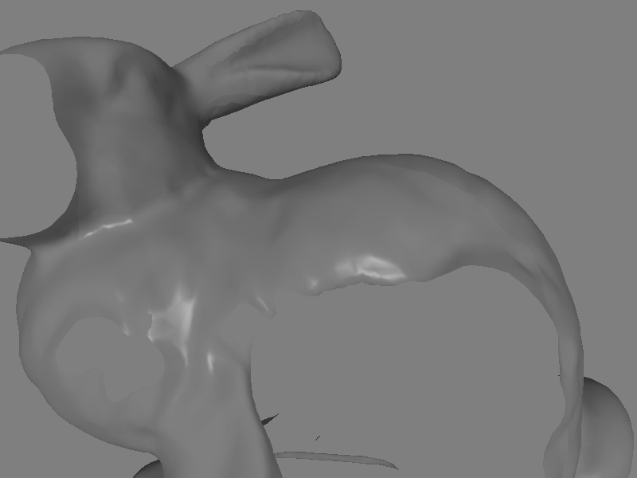
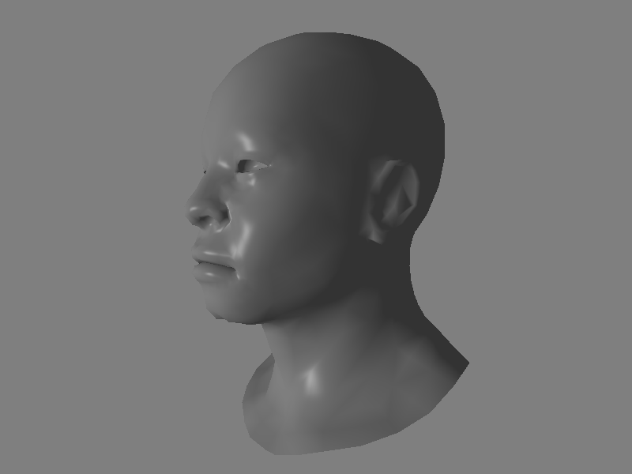
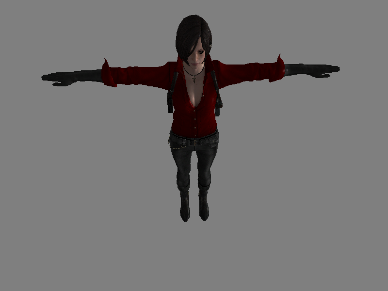
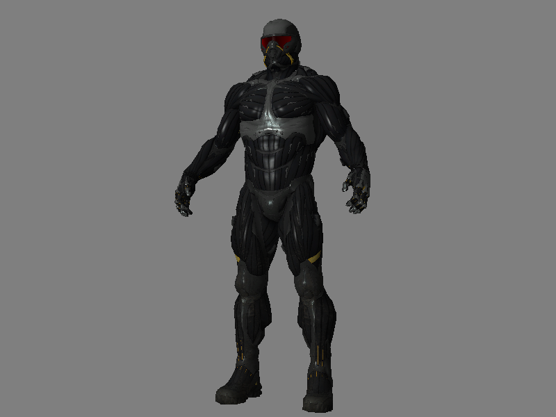
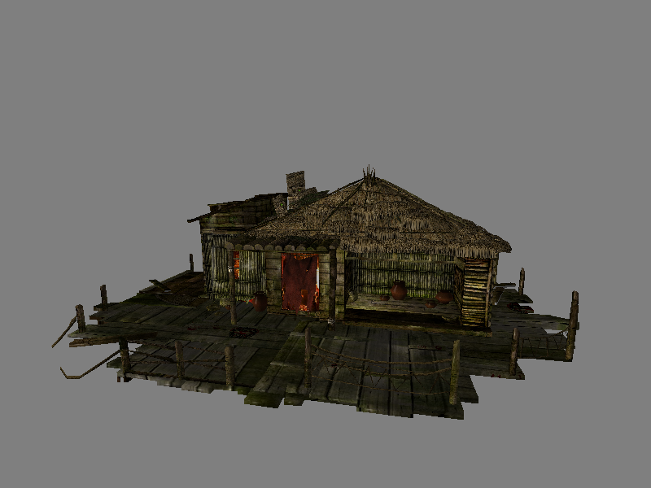
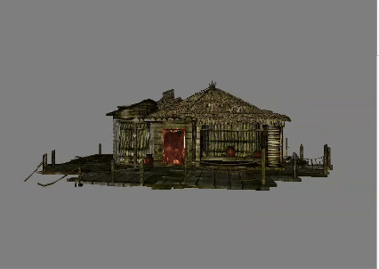

# SoftRenderer
SoftRenderer is a software rasterization renderer based on c++ 20. The main purpose of the project is to learn the principles of modern rendering. Currently only linux is supported.
#### Window



#### Rendering










---

### Dependencies
- math: [glm](https://github.com/g-truc/glm)
- 3D model loading and processing: [Assimp](https://github.com/assimp/assimp)
- Parallel programming and performance optimization: [oneTBB](https://github.com/uxlfoundation/oneTBB)

---

### Feature
writing in C++20
###### Core Rendering Pipeline
- programmable shader system
- vertex shader,fragment shader
- basic rasterization 
- normal mapping
- Z-buffer based depth testing
- Blinn–Phong reflection model
###### Core Algorithms
- [Bresenham's line algorithm](https://en.wikipedia.org/wiki/Bresenham%27s_line_algorithm)
- [Edge Equation](https://www.scratchapixel.com/lessons/3d-basic-rendering/rasterization-practical-implementation/rasterization-stage.html)
- [Barycentric Coordinates](https://en.wikipedia.org/wiki/Barycentric_coordinate_system)

###### Rendering Optimizations
- Face Culling
- Parallel Optimization(Custom & TBB)
- [SIMD Acceleration](https://en.wikipedia.org/wiki/Single_instruction,_multiple_data)(Edge Equation,Barycentric Calculation, Attribute Interpolation, Depth Testing & Comparison...)
###### Control
- orbital camera controls 
Orbit
Pan
Zoom
Reset
- Dynamic Lighting Controls
Adjust light source position in real-time
Modify light color and intensity on-the-fly
Enable/disable individual light sources
- Interactive Rendering Options
Real-time optimization method selection
Dynamic quality/performance trade-off adjustment
Live parameter tuning for visual effects
- switch the model at runtime
- switch the shading model at runtime

---

### Quick Setup Guide
###### System Requirements
- OS: Linux with Qt6
- Compiler: GCC 11+ or Clang 12+ (C++20)
- CMake: 3.20+
###### Build & Run

```cpp
#---------------
# Ubuntu/Debian
sudo apt install build-essential cmake qt6-base-dev libglm-dev libassimp-dev libtbb-dev

# Fedora/RHEL
sudo dnf install gcc-c++ cmake qt6-qtbase-devel glm-devel assimp-devel tbb-devel
#---------------

git clone https://github.com/wwoad/SoftRenderer.git
cd SoftRenderer

mkdir build && cd build
cmake ..
make -j$(nproc)

./SoftRenderer

```


